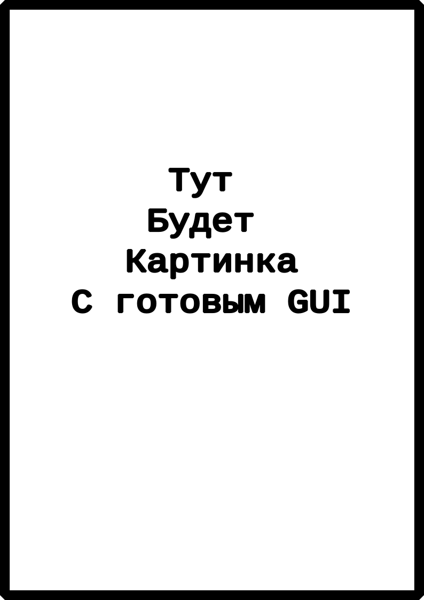

# Отчет по проделаной работе (проектирование GUI)

## Быстрый доступ
* [Первый отчет (постановка задачи (04.08.23)](#04.08.23)
* [Панель импеллеров(08.08.23)](#08.08.23)

# 04.08.23
#### 1. Описание рабочего монитора
>|     <!-- -->     |                 <!-- -->                 |
>|:-----------------|-----------------------------------------:|
>|Разрешение экрана |	             1920х1080                 |
>|Габариты          |	         487 х 320 х 57 мм             |
>[Все параметры можно найти по ссылке](https://www.reallab.ru/catalog/industrial-monitors/im-18/)
> Монитор будет располагаться на стойке в вертикальной ориентации в силу нехватки места

<!-- Картинка -->

    
    

#### 2. Задача

**<<РЕДАКТИРОВАТЬ>>**  
Предполагается сделать несколько окон, которые будут активны в разных состояниях работы пульта РСУ. 

До предоставления подробного ТЗ, мы предоставляем своё видение составленное на основе следующего примера
<!-- Картинки -->

Пример GUI для РСУ

    

#### 3. **Предлагаемый нами перечень состояний окон с описанием:**
1) **Основной вид**
    > Содержит краткое представление всех данных: 
    > - Шторка содержащая часы, дату и т.п.
    > - Табло текстовых сообщений
    > - Интерактивная модель пульта
    > - Панель данных об импеллерах
    > - Панель данных об аккумуляторах
<!-- Картинка -->

    
    

2) **Окно зарядки АКБ**
    > По ТЗ необходимо выводить полную информацию по ячейкам аккумляторов (температура, наряжение, активность)
<!-- Картинка -->

    
    
    

3) **Окно конфигурации**
    > ???
<!-- Картинка -->

    
    
    

4) Состояние управления импеллерами 
    > **<<РЕДАКТИРОВАТЬ>>** 
    > Включает в себя
<!-- Картинка -->

    
    
    

Лягушка

    

# Вопросы
* Нужно ли выводить модель пульта?

# 08.08.23
