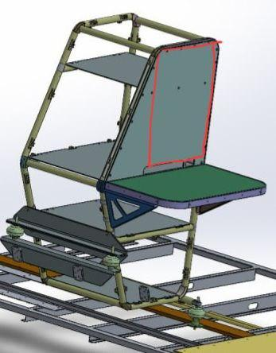

# Отчет по проделаной работе (проектирование GUI)

## Быстрый доступ
* [Первый отчет (постановка задачи 04.08.23)](#04-08-23)

# 04.08.23
#### 1. Описание рабочего монитора
>|     <!-- -->     |                 <!-- -->                 |
>|:-----------------|-----------------------------------------:|
>|Разрешение экрана |	             1920х1080                 |
>|Габариты          |	         487 х 320 х 57 мм             |
>[Все параметры можно найти по ссылке](https://www.reallab.ru/catalog/industrial-monitors/im-18/)
> Монитор будет располагаться на стойке в вертикальной ориентации в силу нехватки места
<!-- 
Лягушка
 -->

    
    

#### 2. Задача

**<<РЕДАКТИРОВАТЬ>>**  
Предполагается сделать несколько окон, которые будут активны в разных состояниях работы пульта РСУ. 

До предоставления подробного ТЗ, мы предоставляем своё видение 

#### 3. **Предлагаемый нами перечень окон с описанием:**
1) **Основное окно**
    > Данное окно будет использоваться в качевстве основного. На нем будут распологаться 
    > Краткое представление всех данных, табло текстовых сообщений
2) **Специальные окна**  
    - Шторка — небольшая область для вывода времени и прочей тривиальной информации. Находится в верхней части экрана 
2) **Окно зарядки АКБ**
    > По ТЗ необходимо выводить полную информацию по ячейкам аккумляторов (температура, наряжение, активность)
3) **Окно конфигурации**
    > ???
4) Окно управления импеллерами
    > Включает в себя

<!-- Картинка -->

    
Пример GUI для РСУ

    

<!-- Картинка --> 

    
Лягушка

    

# Вопросы
* Нужно ли выводить модель пульта?